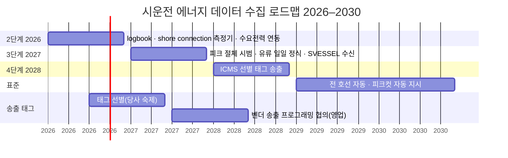

# 시운전 에너지 데이터 수집 로드맵 2026–2030

> **이 문서가 답하는 질문**: 안벽 계류 중인 호선을 **매 시각 육전으로 둘지, 발전기로 돌릴지** —
> 즉 **전기요금과 유류비를 합한 총 에너지 비용이 싼 쪽**을 고르려면 여섯 가지 데이터가 필요하다.
> 그 여섯 가지를 **지금(수기)에서 2030(선박 데이터 직결)까지 어떤 단계를 거쳐 수집해 갈 것인가**를 적는다.
>
> **절감 레버는 둘이다. 방향이 서로 반대다.**
>
> | | 레버 A — 평시 | 레버 B — 피크 |
> |---|---|---|
> | 상황 | 피크가 아닌 **대부분의 시간** | 조선소 피크 시간대 |
> | 싼 쪽 | **육전** — 발전기를 돌리면 그 시간만큼 **손해** | **발전기** — 조선소 피크를 낮춘다 |
> | 절감 항목 | 불필요 발전기 가동 축소 → **유류비** | 피크 인하 → **기본요금**(12개월 적용) |
> | 전제 | logbook + 측정기 — **2026 데이터만으로 가능** | + 조선소 수요전력 연동 — 2027 시범 |
>
> 레버 A 는 **주장이 아니라 확인**이다. 불가피한 가동(발전기 검사·부하시험)은 호선 이벤트로 식별되므로
> 그것을 걷어내고 **남은 시간을 드러내는 것**이 2026 의 첫 산출물이고, 줄일 여지는 그 다음에 판단한다.
>
> **6종 데이터**: ① 유류 사용량 ② 육상전력(육전) ③ 발전기 생산 전력 ④ 전력/유류 사용 시 가동 장비 ⑤ 운전방법 ⑥ 발전기 가동 사유
>
> **단계** (이 문서의 뼈대)
>
> | | 1단계 · 현재 | 2단계 · 2026 목표 | 3단계 · 2027~ | 4단계 · 2028~ |
> |---|---|---|---|---|
> | **한 줄** | 수기 취합 | **logbook + shore connection 측정기** · 그 외 수기 | **평시 절감 실행 + 피크 절체 시범** · 스마트십(SVESSEL) 호선 배 데이터 수신 | ICMS **선별 태그 송출** → 실시간·무인 |
> | **유류** | 기간(일정구분) 취합 + 일 1회 사운딩 파일럿 | 일 1회 사운딩(수기 유지) | 일일 입력 정식 · 기간 산출 자동 · SVESSEL 유량 수신 | ICMS 유량 송출 |
> | **전기** | 육전 누적값 일 단위 수기, 발전기는 없음 | **측정기**: 육전 15분 자동 / **logbook**: 발전기 운전일지·사유 | 가동 시간 분류 → 평시 절감 · 수요전력 정렬 → 피크 시범 · SVESSEL PMS 수신 | ICMS 송출(PMS kW·차단기) |
>
> **PMS·ICMS 는 전 호선 기본 사양**이다 — 계측기는 이미 배에 있다. 3·4단계의 일은 계측이 아니라 **송출**이다.
> 4단계는 ICMS 가 **선별된 태그를 송출하도록 프로그래밍**하는 벤더 협의(영업 경유)가 필요하고, **어떤 태그를 선별할지는 당사 숙제**다.
>
> **조선소 수요전력(한전 15분)은 이미 시스템이 있다.** 2단계에서 그 값을 받아오는 연동만 하면 피크 판단(레버 B)의 기준값이 생긴다.
> **레버 A 는 이 연동 없이도 돌아간다** — 발전기 운전일지와 사유 코드만으로 평시 가동 시간이 드러난다.
>
> **범위 밖**: 인도 선박에 탑재하는 선주용 모니터링 제품, 운항 단계 규제(CII·EU ETS 등).
> **표기**: `[사실]` 코드·문서·진술로 확인 · `[추정]` 판단 · `[미확인]` 확인 필요. §6 매트릭스가 로드맵 도식 변환의 원본이다.

---

## 1. 개요

- **목표는 총 에너지 비용(전기요금 + 유류비)의 최소화**다. 호선의 에너지원은 어느 시각이든
  **육전 아니면 발전기, 하나**이므로 전력 사용량과 유류 사용량은 음의 상관이고, 어느 쪽을 쓰느냐가 곧 비용을 정한다.
- **평시에는 육전이 싸다** — 이때 발전기를 돌리면 그 시간만큼 유류비 손해다(레버 A). `[추정]`
  **피크 시간대에만 역전**된다 — 산업용 기본요금이 최대수요전력(피크)으로 정해지므로,
  그 시각에 호선을 발전기로 절체하면 조선소 피크가 내려가 12개월 요금이 줄어든다(레버 B).
- 즉 발전기는 "돌리면 좋은 것"도 "안 돌리면 좋은 것"도 아니고, **시각에 따라 답이 바뀐다.**
  그 답을 알려면 6종 데이터가 **같은 시각 축**에 있어야 하는데, 현재는 유류만 하루 1회 수기이고
  전기는 발전기 쪽 기록이 아예 없다. `[사실]`
- **2단계(2026)에서 logbook 과 shore connection 측정기, 기존 수요전력 시스템 연동을 마치면 두 레버의 판단 데이터가 전부 갖춰진다**
  (수기 4·자동 1·반자동 1). 그중 **레버 A 는 수요전력 연동을 기다리지 않고** 운전일지만으로 실태 파악이 시작된다.
  3단계(2027)에 평시 절감 실행과 피크 절체 시범으로 **총비용 절감액을 실측**하고, 4단계(2028~)에 배 데이터 송출로 사람 손을 뗀다.

---

## 2. 배경 및 문제 정의

### 2.1 에너지 구조 — 언제 발전기가 이득이고 언제 손해인가

| | 육전(한전 전력) | 발전기(자체 발전) |
|---|---|---|
| 에너지 | kWh | 유류 L → kWh |
| 비용 구조 | **기본요금**(피크 kW × 단가 × 산정 개월) + **전력량요금**(kWh × 시간대 단가) | 유류 L × 유가 (+ 정비비) |
| **kWh 당 원가 (평시)** | **싸다** — 전력량요금 단가 `[미확인]` 계약 종별 | **비싸다** — 약 0.2–0.25 L/kWh × 유가 `[추정]` |
| **kWh 당 원가 (피크)** | 전력량요금 + **기본요금 유발분** → 비싸진다 | 평시와 같다(연료비만) |
| 탄소 | 한전 배출계수(Scope 2) | 유종 배출계수(Scope 1), kWh 당 더 높다 `[추정]` |

- 호선 배전반은 절체 순간을 빼면 **육전·발전기 동시 급전을 허용하지 않는다** → 호선 단위 택1.
- **답은 시각에 따라 뒤집힌다.**

  | | 평시 (레버 A) | 피크 시간대 (레버 B) |
  |---|---|---|
  | 조건 | 그 시각 부하가 조선소 피크를 만들지 않는다 | 그 시각 부하가 **피크를 끌어올린다** |
  | 싼 쪽 | **육전** | **발전기** |
  | 판정식 | `발전기 kWh 원가 > 전력량요금 단가` → 발전기는 **손해** | `기본요금 단가 × 산정 개월 수 > 그 시간대 발전기 연료비 증가분` → 발전기가 **이득** |
  | 절감 방법 | 불필요 가동을 **줄인다** | 의도적으로 **돌린다** |

  `[추정]` 기본요금 산정 규칙(15분 평균·산정 기간·계절 가중) 세부는 `[미확인]`

- **평시 발전기 가동이 전부 낭비는 아니다.** 발전기 검사·부하시험처럼 **어차피 돌려야 하는 시간**은
  호선 이벤트로 식별된다(⑥ 사유 `TRIAL`·`LOAD_TEST`). 육전 불가(`SHORE_NA`)도 정당한 사유다.
  **그것들을 걷어내고 남는 시간이 얼마인지가 레버 A 의 출발점**이고, 지금은 그 비율을 모른다. `[미확인]`
- 부수 관찰 `[추정]`: 발전기 부하·병렬 시험은 어차피 돌리는 시간이므로 그 시각을 **피크에 맞추면**
  추가 연료 없이 레버 B 효과를 얻는다 — 두 레버가 충돌하지 않고 맞물리는 유일한 지점이다.
- 탄소는 두 레버의 방향이 **반대**다 — A 는 배출을 줄이고, B 는 늘린다. 비용·탄소 두 축으로 함께 본다.

### 2.2 결과물 → 필요한 데이터 (우선순위 근거)

결과물은 이 로드맵으로 얻으려는 것 6가지다. 어떤 데이터가 몇 개의 결과물에 걸려 있는지가 우선순위다.

| 결과물 | ① 유류 | ② 육전 kW | ③ 발전기 kW | ④ 장비 | ⑤ 운전방법 | ⑥ 사유 | 참조: 수요전력·요금표 |
|---|:-:|:-:|:-:|:-:|:-:|:-:|:-:|
| **R1 절체 판단 (양방향)** — 평시엔 육전으로, 피크엔 발전기로 | △ 손익만 | **●** 15분 | **●** 가용 용량 | – | **●** 현재 원천 | ○ | **●** B 판정에 필수 |
| **R2a 평시 불필요 가동 축소 (레버 A)** — 불가피분을 걷어낸 나머지 시간 | **●** 그 시간 연료비 | ○ 검증용 | **●** 가동 시간 | – | **●** 원천 | **●** 불가피/확인대상 분리 | – **불필요** |
| **R2b 피크 절감 (레버 B)** — 기본요금 인하 − 추가 연료비 | **●** 추가 소비분 | **●** | **●** | – | ○ | **●** 피크컷 분 분리 | **●** 피크 이력·단가 |
| **R3 호선별 에너지 비용** (연료비 vs 전기비) | **●** | **●** 일 단위면 됨 | – | – | – | – | ○ 요금표 |
| **R4 탄소 산정** (직접/간접 배출) | **●** 유종별 | **●** 일 단위면 됨 | – | – | – | – | – |
| **R5 시운전 항목별 원단위 → 경비 예측** | **●** | **●** | ○ | **●** | – | **●** 어느 항목인지 | – |
| **걸린 결과물 수 → 우선순위** | 6 · **최우선** | 5 · **최우선** | 4 · **높음** | 1 · 낮음 | 3 · 중 | **5 · 높음** | R1·R2b 전제 · 높음 |

- **② 육전 전력**은 여전히 최우선이다 → 2단계 shore connection 측정기가 정확히 이것이다.
- **⑥ 가동 사유의 비중이 올라갔다.** 불가피한 가동(`TRIAL`·`LOAD_TEST`·`SHORE_NA`)과 **확인 대상(`ETC`)**을
  가르는 유일한 수단이라 **레버 A 전체가 여기에 달려 있다.** ③⑤⑥ 은 logbook 하나로 한꺼번에 채워진다.
- **레버 A(R2a)는 참조 데이터가 필요 없다** — 수요전력 연동을 기다리지 않고 운전일지만으로 시작된다.
  반대로 레버 B(R1·R2b)는 참조 데이터 없이는 판단 자체가 불가능하다.
- ④ 장비는 후순위(R5 만) — 항목을 6~8종으로 최소화한다.

### 2.3 데이터별 수집 방법 후보와 현재 수준

| 데이터 | 가능한 수집 방법 (쉬운 것 → 자동) | 현재 수준 | 2단계(2026) 후 |
|---|---|---|---|
| **② 육전 kW** | ⓐ 접속점 적산계 일 1회 수기 → ⓑ **shore connection 측정기** 15분 자동 → ⓒ 선내 PMS 육전 수전 kW(교차검증) | ⓐ 일 누적 수기, 앱 밖 `[사실]` 진술 | **ⓑ 자동** |
| **③ 발전기 kW** | ⓐ **logbook** 기동/정지·부하% 수기 → ⓑ 발전기 패널 계기 판독 → ⓒ PMS 발전기별 kW → ICMS/SVESSEL | 없음 `[사실]` | **ⓐ 수기** |
| **① 유류** | ⓐ 기간 단위 취합(엑셀) → ⓑ 일 1회 사운딩 앱 입력 → ⓒ 발전기 운전시간×SFOC 교차검증 → ⓓ 선박 유량계(ICMS/SVESSEL) | ⓐ 정식 · ⓑ 파일럿(`test_`) `[사실]` | ⓑ 유지 + ⓒ 가능(③ 이 생기므로) |
| **⑤ 운전방법** | ⓐ logbook 절체 시각 수기 → ⓑ **측정기 전류 0 ↔ logbook 으로 절체 추정** → ⓒ PMS 차단기 상태 | 없음 | ⓐ + ⓑ **반자동**(측정기 부산물) |
| **⑥ 가동 사유** | ⓐ logbook 매 기동 사유 코드(불가피/확인대상 분리) → ⓑ 시운전 항목은 순서도에서, 피크컷은 관제 지시에서 자동 | 4종, 연료 감소 시만 `[사실]` | **ⓐ 수기** — 레버 A 의 열쇠 |
| **④ 장비** | ⓐ 일별 체크리스트 → ⓑ ICMS 운전 상태 | 연료 감소 시만 `[사실]` | ⓐ 수기(항목 최소화) |
| **참조: 조선소 수요전력** | 기존 조선소 전력관리 시스템(한전 15분) → **연동**. 레버 B 에만 필요 | **시스템 있음** `[사실]` 진술 · 미연동 | **연동** |
| **참조: 요금표·유가** | 요금표 등록(수기 1회) · 유가 `fuel_price.parquet` | 유가만 있음 `[사실]` | 요금표 등록 |

> 2단계가 끝나면 **두 레버의 판단 데이터가 전부 생긴다.**
> - **레버 A(R2a)** 는 ③⑥ 만으로 1차 산출이 되므로 **측정기·수요전력 연동을 기다리지 않는다** —
>   logbook 이 붙는 즉시 "불가피 / 확인 대상" 가동 시간 비율이 나온다.
> - **레버 B(R1·R2b)** 는 측정기 + 수요전력 연동이 모두 필요하고, 그 둘이 끝나는 2026 말에 시범이 가능하다.

### 2.4 현재 수집 상태 (코드 근거)

| # | 데이터 | 지금 어떻게 | 해상도 | 결손 |
|---|---|---|---|---|
| ① | 유류 사용량 | 정식: 월 엑셀 → `fuel_usage.parquet`, 호선당 `일정구분`(`LC~GT+1`/`AC`/`통합시운전`/`ST,DP`/`인도준비`) 기간 단위 `[사실]` `DATA_SCHEMA.md`. 파일럿: SSIMS 일일 사운딩(mm→L, VCF·트림 보정) `[사실]` `log/backend/main.py` | 기간 / 일 | 일일값이 정식 집계로 안 이어짐(이중 입력) |
| ② | 육상전력 | 누적 전기사용량 일 단위 수기 `[사실]` 진술. 코드베이스에는 없음 `[사실]` | 일 | 앱 미수용 |
| ③ | 발전기 생산 전력 | — | — | kW·kWh 판독 없음. 가동일수만 유류 배분에서 역산 `[사실]` `SHARED_CONTRACT.md` |
| ④ | 가동 장비 | SSIMS ΔL 감소 시에만 장비+대수 → 정격 가중치×대수로 배분 `[사실]` `fuel_reading_equipment` | 감소 이벤트당 | 원천(육전/발전기) 태그 없음 |
| ⑤ | 운전방법 | — | — | 육전/발전기/절체 구분 없음 |
| ⑥ | 발전기 가동 사유 | SSIMS 사유 4종(검사/지원/앵카링/시운전), 감소 시에만 `[사실]` `usage_reasons` | 감소 이벤트당 | 매 기동 단위 아님. 피크컷 코드 없음 |

---

## 3. 목표

| 단계 | 시기 | 도달 상태 | 완료 기준 |
|---|---|---|---|
| 1단계 | 현재 | 유류 수기, 전기 기록 없음 | 현황 확정 · 기준선 착수 |
| **2단계** | **2026** | logbook(③⑤⑥④ 수기) + shore connection 측정기(② 자동) + 수요전력 연동 + 요금표 | **M1 6종 전부 존재** + **발전기 가동 시간의 불가피/확인대상 비율 산출** |
| 3단계 | 2027 | **평시 절감 실행(레버 A) + 피크 절체 시범(레버 B)** · 유류 일일 정식(엑셀 폐지) · SVESSEL 호선 배 데이터 수신 | **M2 총비용 절감액 실측** · SVESSEL 2척 수신 |
| 4단계 | 2028 | ICMS 선별 태그 송출 → ③⑤④ 자동, ⑥ 순서도 자동 | **M3 ICMS 송출 호선 연결** · 절체 자동 감지 |
| 표준 | 2029–30 | 전 호선 자동 · 관제 피크컷 지시 · 사운딩 폐지 | **M4 절체 판단 무개입** |

- 최종 KPI: **매 시각 총 에너지 비용이 싼 쪽을 수기 개입 없이 고른다** — 6종이 같은 시각 축(15분)에 모인 상태. (2030)
- 중간 KPI(2026): **시운전 시험 외 발전기 가동 시간의 비율** — 현재 `[미확인]`, M1 의 핵심 산출물이다.
- 수기로 남는 항목 수: 4(2026) → 3(2027) → 1(2028, 사유 일부) → 0(2030) `[추정]`

---

## 4. 핵심 개념 정의

| 용어 | 정의 |
|---|---|
| **logbook** | 현장 앱(SSIMS)의 발전기 운전일지 — 기동/정지 시각·부하%·대수·가동 사유·절체 기록. 수기 4종(③④⑤⑥)의 단일 입력 창구 |
| **shore connection 측정기** | 호선 육전 수전반(shore connection box)에 다는 조선소 자산 전력계. 15분 kWh·kW 자동. 선박 쪽에 달므로 호선별 분리가 자연히 된다 |
| **수요전력 시스템** | 조선소가 이미 갖고 있는 한전 15분 최대수요전력 관리 시스템. 로드맵은 이 값을 **받아오는 연동**만 한다 |
| **PMS · ICMS** | 전 호선 기본 사양. PMS 가 발전기별 kW·kWh·차단기 상태를, ICMS 가 유량·탱크 레벨·장비 운전 상태를 이미 갖는다 |
| **SVESSEL** | 스마트십 플랫폼. 탑재 호선은 ICMS/PMS 데이터가 이미 육상 플랫폼에 올라오므로 사내 API 수신만 하면 된다 (3단계) |
| **ICMS 선별 태그 송출** | SVESSEL 미탑재 호선. ICMS 가 선별된 태그를 조선소 수신 게이트웨이로 보내도록 **프로그래밍** — 벤더 협의(영업 경유), 당사 표준 사양으로 관리 (4단계) |
| **송출 태그 선별** | 6종을 만들기 위해 ICMS/PMS 에서 뽑을 태그 목록 + 표준 태그 → 호선 태그 매핑표. **당사 숙제**, 4단계 전(2026~27)에 확정 |
| **원천 태그** | 그 시각 호선 급전원 `SHORE` / `GEN`. ④⑤⑥ 이 모두 이 태그에 붙는다 |
| **운전모드 코드** (⑤) | `SHORE_ONLY` · `GEN_ONLY` · `CHANGEOVER` · `PARALLEL_TEST` · `BLACKOUT` `[추정]` 초안 |
| **가동 사유 코드** (⑥) | 발전기를 **왜** 돌렸는지. 현 4종을 흡수하고 **불가피/확인대상**을 가른다 — 레버 A 의 열쇠 · **불가피** `TRIAL`(시운전 항목 ID 동반) · `LOAD_TEST`(부하·병렬 시험) — 호선 이벤트로 자동 식별 가능 · **정당** `SHORE_NA`(육전 불가 — 설비·공사) · **의도적** `PEAK_CUT`(레버 B 로 일부러 돌림) · **확인 대상** `ETC` — 위 어디에도 안 들어가는 시간. **이 몫을 드러내는 것이 2026 의 산출물** |
| **레버 A / 레버 B** | A = 평시 불필요 발전기 가동 축소(유류비 절감, 참조 데이터 불필요) · B = 피크 시간대 절체(기본요금 절감, 수요전력 연동 필요). 탄소 방향은 서로 반대 |
| **피크 컷 지시** | 관제(SSIMS 웹)가 수요전력 추이를 보고 특정 호선에 발전기 절체를 요청하는 이벤트. 3단계 수동 → 표준 단계 자동 |

---

## 5. 단계별 수집 방법

### 5.0 측정 지점·방법 요약

읽는 법: 1·2단계는 **사람이 재거나 조선소가 붙인 계측기**, 3·4단계는 **배가 원래 갖고 있는 계측기**의 값을 밖으로 내보내는 것. 3단계(SVESSEL)·4단계(ICMS)는 지점이 같고 전송 경로만 다르다.

| 데이터 | 1단계 현재 | 2단계 2026 | 3단계 SVESSEL 호선 | 4단계 ICMS 송출 호선 |
|---|---|---|---|---|
| **① 유류** | **지점** 연료 탱크 **방법** 사운딩 → 기간 취합 엑셀 / 일 1회 앱 파일럿 | 동일(수기 유지) · ③×SFOC 교차검증 시작 | **지점** 연료 공급/리턴 유량계 + 탱크 레벨(기본 사양) **방법** ICMS → SVESSEL → 사내 API | **방법** ICMS 선별 태그 송출 |
| **② 육전** | **지점** 접속점 적산계 **방법** 누적 kWh 일 1회 수기 | **지점** shore connection box **방법** 측정기 15분 자동 | **지점** PMS 육전 수전 kW **방법** SVESSEL — 교차검증 | PMS → ICMS 송출 |
| **③ 발전기** | 없음 | **지점** 발전기 패널 계기 **방법** logbook 수기 | **지점** 발전기별 ACB 전력계 → PMS **방법** SVESSEL | PMS → ICMS 송출 |
| **④ 장비** | 감소 시만 | **방법** logbook 일별 체크리스트 + 원천 태그 | **지점** ICMS 장비 운전 상태 | ICMS 송출 |
| **⑤ 운전방법** | 없음 | **방법** logbook 절체 기록 + 측정기 전류 0 으로 추정 | **지점** PMS 차단기 상태 → 절체 자동 | PMS → ICMS 송출 |
| **⑥ 사유** | 4종·감소 시만 | **방법** logbook 매 기동 사유 코드 | `TRIAL`·`LOAD_TEST` 순서도 자동 · `PEAK_CUT` 관제 자동 | 동일 |
| **참조** | 수요전력 시스템 있음·미연동 | **연동** + 요금표 등록 | 피크 시범에 사용 | 관제 자동 지시 |

- 3·4단계 공통 선행 작업: **송출 태그 선별**(당사 숙제) — 위 표의 3단계 "지점" 열이 곧 태그 목록의 골격이다.

### 5.1 유류 트랙 (①)

| 단계 | 시기 | 수집 방법 | 해상도 | 앱 변경 |
|---|---|---|---|---|
| 1단계 | 현재 | 호선당 5~6개 `일정구분` 기간별 취합 → 월 엑셀 → `fuel_usage.parquet` `[사실]` + SSIMS 일 1회 사운딩 파일럿 | 기간 / 일 | — |
| 2단계 | 2026 | 수기 유지. logbook 의 ③ 운전시간×정격×SFOC 로 **기대 소비량**을 산출해 사운딩 ΔL 과 교차검증 | 일 | 편차 표시 |
| 3단계 | 2027 | SSIMS 일일 입력 **정식**(`test_` 해제), 측정 시각·트림 필수. 일일값을 `trial_schedule` 일정구분 경계로 잘라 `fuel_usage` 형식으로 산출 → 월 엑셀 폐지. **SVESSEL 탑재 호선 2척** 유량계 값 사내 API 수신, 사운딩과 오차 검증 | 일 / 분 | 기간 산출 잡(`data_manager_F`) · SVESSEL 수신 API |
| 4단계 | 2028 | SVESSEL 미탑재 호선은 ICMS 선별 태그 송출로 유량 수신 | 분 | ICMS 수신 게이트웨이 |
| 표준 | 2029–30 | 전 호선 선박 데이터. 사운딩은 수급·이송 확인용. 대체연료 포함 | 분 | 사운딩 입력 폐지 |

- 리스크: 호선마다 SVESSEL 탑재 여부·ICMS 기자재·태그 명명이 다름 → 호선 사양서에 표기, 표준 태그 → 호선 태그 매핑표 관리 · 선별 태그 송출 프로그래밍은 **당사 표준 사양**, 벤더·선주 협의 필요 시 **영업 경유**

### 5.2 전기 트랙 (② 육전 · ③ 발전기)

| 단계 | 시기 | 수집 방법 | 해상도 | 앱 변경 |
|---|---|---|---|---|
| 1단계 | 현재 | ② 접속점 적산계 누적값 일 단위 수기(앱 밖). ③ 없음 | 일 | — |
| **2단계** | **2026** | ② **shore connection 측정기**(조선소 자산) 15분 자동 → parquet. ③ **logbook** 운전일지(기동/정지·부하%·대수·**사유**) 수기 → **가동 시간 분류 리포트**(불가피 `TRIAL`·`LOAD_TEST`·`SHORE_NA` / 확인 대상 `ETC`) = **레버 A 의 1차 산출물**. **조선소 수요전력 시스템 연동** + 요금표 등록 → 호선 부하·조선소 피크·발전기 가용 대수가 같은 시각 축에 놓인다(레버 B 준비 완료) | 15분 / 기동 | 측정기 수신 경로 · logbook 메뉴 · 분류 리포트 · 수요전력 연동 |
| 3단계 | 2027 | **평시 절감 실행(레버 A)** — 확인 대상 가동 시간을 호선·사유별로 줄이고 감소분을 유류비로 환산(R2a). **피크 절체 시범(레버 B)** — 관제가 수요전력 추이를 보고 호선에 절체 요청(수동 지시), logbook 에 `PEAK_CUT` 기록 → 기본요금 인하분 − 추가 연료비 산정(R2b). 둘을 합쳐 **총비용 절감액 실측**. SVESSEL 호선은 PMS 발전기별 kW 수신(③ 자동 시작) | 15분 / 1분 | 관제 화면 피크 여유 표시 · 가동 시간 추이 · SVESSEL 수신 |
| 4단계 | 2028 | ICMS 선별 태그 송출 — PMS 발전기별 kW·kWh·차단기 상태. ③ 자동 | 1분 | ICMS 수신 게이트웨이 · 태그 매핑 |
| 표준 | 2029–30 | ②③ 자동. 관제가 피크컷을 자동 지시 | 실시간 | — |

- 리스크: 측정기 설치·철거 절차(호선 인도 전 회수) · ICMS 송출 프로토콜·태그 명명 기자재별 상이 `[미확인]` · 수요전력 시스템 제공 방식(API/파일/DB)·담당 부서 `[미확인]`

### 5.3 부가 속성 (④ 장비 · ⑤ 운전방법 · ⑥ 가동 사유)

세 항목은 독립 트랙이 아니라 **유류·전기 값에 붙는 태그**다. 2단계에서 logbook 이 한꺼번에 받고, 3·4단계에서 상태 신호가 대신한다.

| 단계 | ④ 가동 장비 | ⑤ 운전방법 | ⑥ 발전기 가동 사유 |
|---|---|---|---|
| 현재 | 감소 시에만 장비+대수 | 없음 | 4종, 감소 시에만 |
| **2단계 2026** | logbook **일별 체크리스트** + 원천 태그(항목 6~8종으로 제한) | logbook **절체 기록**(모드·시각) + 측정기 전류 0 으로 절체 추정 | logbook **사유 코드 5종**, 매 기동 필수 |
| 3단계 2027 | SVESSEL 호선 ICMS 운전 상태(파일럿) | SVESSEL 호선 PMS 차단기 상태(파일럿) | `PEAK_CUT` 은 관제 지시 시 기록 · 사유별 kWh·L 집계 |
| 4단계 2028 | ICMS 송출로 자동 | PMS 차단기 상태로 절체 자동 | `TRIAL`·`LOAD_TEST` 는 `process` 순서도에서 자동 |
| 표준 | 자동 · 장비별 원단위 | 자동 · 모드 체류 통계 | `PEAK_CUT` 관제 자동 · `SHORE_NA`·`ETC` 만 수기 |

- logbook 은 하루 시작 시 한 화면에서 모드·장비·발전기 상태를 묶어 입력 → 자동화되는 즉시 수기 제거
- 리스크: 체크리스트 형식화 → 장비 6~8종 제한 · 사유가 `ETC` 로 몰림 → 5종 고정, 상세는 자유입력(실명 금지)

---

## 6. 로드맵 매트릭스 (도식 변환용 원본)

행 = 데이터 항목, 열 = 단계, 셀 = **그 단계에 도달하는 수집 방법**. 배경색은 수기(회색) · 조선소 계측기/반자동(연청) · SVESSEL(청) · ICMS(네이비) · 표준(진네이비).

| # | 데이터 | 1단계 · 현재 | **2단계 · 2026** | 3단계 · 2027 | 4단계 · 2028 | 표준 · 2029–30 |
|---|---|---|---|---|---|---|
| ① | 유류 사용량 | 기간 취합 + 일 1회 사운딩 파일럿 | 수기 유지 · ③×SFOC 교차검증 | 일일 정식 · 엑셀 폐지 · **SVESSEL 2척 유량 수신** | **ICMS 유량 송출** | 전 호선 자동 · 사운딩 폐지 · 대체연료 |
| ② | 육상전력 | 일 누적 수기(앱 밖) | **shore connection 측정기 15분 자동** | 수요전력과 정렬 · PMS 값 교차검증 | ICMS 송출 | 실시간 · 피크 여유 표시 |
| ③ | 발전기 생산 전력 | 없음 | **logbook 운전일지**(기동/정지·부하%) | SVESSEL PMS kW 수신(파일럿) | **ICMS 송출**(PMS kW·차단기) | 실시간 · 실측 SFOC |
| ④ | 가동 장비 | 감소 시만 | logbook 일별 체크리스트 + 원천 태그 | ICMS 운전 상태(파일럿) | 자동 | 자동 · 장비별 원단위 |
| ⑤ | 운전방법 | 없음 | logbook 절체 기록 + **측정기로 절체 추정** | PMS 차단기 상태(파일럿) | 자동 | 자동 · 모드 체류 통계 |
| ⑥ | 발전기 가동 사유 | 4종·감소 시만 | **logbook 사유 코드 5종 · 매 기동** → 불가피/확인대상 분류 | 확인대상 가동 축소(레버 A) · `PEAK_CUT` 기록 | `TRIAL`·`LOAD_TEST` 순서도 자동 | `PEAK_CUT` 자동 · 잔여 수기 |
| 참조 | 조선소 수요전력·요금표 | 시스템 있음 · 미연동 | **연동 + 요금표 등록** (레버 B 에만 필요) | **피크 절체 시범** · 절감 산정 | 관제 화면 통합 | 피크컷 자동 지시 |
| 태그 | 송출 태그 선별·협의 | — | 태그 선별 초안(당사 숙제) | SVESSEL 커버리지 확인 · 표준 사양 · 벤더 협의 착수(영업) | 송출 프로그래밍 적용 | 표준 사양 확정 |
| — | **마일스톤** | 현황 확정 | **M1 6종 확보 + 평시 가동 실태 파악** | **M2 총비용 절감액 실측(A+B) · SVESSEL 2척** | **M3 ICMS 송출 · 절체 자동 감지** | **M4 절체 판단 무개입** |

---

## 7. 현재 과제와의 관계

| 과제 | 로드맵에서의 역할 | 채우는 데이터 | 기여 결과물 | 단계 | 필요한 확장 |
|---|---|---|---|---|---|
| **logbook** (SSIMS, `log`) | **수기 4종의 단일 입력 창구.** 뒤에는 자동 판독값 수신·관제 지시 창구 | 지금 ① 일 1회, ④⑥ 부분 → **③ 운전일지 · ⑤ 절체 · ⑥ 사유 코드 · ④ 체크리스트** | R3·R4·R5·R6 원천, R1·R2 의 호선 쪽 절반 | 2단계 핵심 | 운전일지·절체·사유 메뉴, `test_` 해제, 일일값 → 기간 집계 자동 |
| **시운전선박전기모니터링** (shore connection 측정기) | **6종 중 유일한 자동 계측.** 최우선 데이터 ② 를 15분으로 만들고 ⑤ 절체까지 덤으로. 선박 쪽 설치라 호선별 분리 문제가 풀린다 | **② 자동 · ⑤ 반자동** | R1·R2·R3·R4 | 2단계 (2026) | 측정값 → parquet 경로. 수요전력 연동과 함께 있어야 R1·R2 완성 |
| **조선소 수요전력 시스템** (기존) | 피크 판단의 **기준값**. 로드맵은 연동만 한다 | 참조 | R1·R2 | 2단계 | 15분 값 수신(제공 방식·담당 `[미확인]`) |
| **ESG 대시보드** (`esg`) | 결과물을 **보여주는 출력 화면.** 데이터를 만들지 않는다 | — | 지금 R4 · R3(유류만) → R2a·R2b 절감 효과 · 가동 시간 추이 | 데이터가 생긴 뒤(3단계) | 전기 축(Scope 2·전기비), 일 단위 뷰, **총비용 = 유류비 + 전기요금** 합산 뷰 |
| `data_manager_F` | 셋을 잇는 관 — parquet 단일 생산자 | — | (연결) | 2단계 | `fuel_daily` · `power_ts` · `gen_run` · `tariff`(가칭) |
| `process` (순서도) | ⑥ 시운전 항목 자동 태깅·R5 원단위의 시각 축 | ⑥ 일부 | R5 | 4단계 | 항목 시각 필드 — 지금은 손대지 않는다 |
| `costplan` / `pjtcost` | R5 소비자 | — | R5 | 표준 | 없음(후순위) |

**순서**: 측정기 + logbook 확장(데이터 생산) → 수요전력 연동 + data_manager(저장) → ESG 확장(표시). ESG 를 먼저 고치면 보여줄 데이터가 없다.

**과제로 잡혀 있지 않은 것**: 전기요금표 등록(작음) · 송출 태그 선별 + 벤더 협의(당사 숙제, 2026~27 시작해야 2028 에 맞는다) · SVESSEL 사내 API 확인(3단계).

---

## 8. 리스크 및 대응

| 리스크 | 영향 | 대응 |
|---|---|---|
| logbook 입력 부담(2단계에 수기 메뉴 신설) | 누락률 악화 | 하루 시작 시 한 화면 묶음 입력 · 장비 항목 6~8종 제한 · 자동화되는 즉시 수기 제거 |
| 측정기 설치·철거 | 호선 인도 전 회수 | 설치·철거 절차서, 자산 대장 |
| 수요전력 시스템 제공 방식 | 2단계 연동 지연 | 담당 부서·제공 방식 조기 확인, 파일 수신 폴백 |
| 태그 선별이 늦어짐(당사 숙제) | 3·4단계 전체 지연 | 2026 하반기 초안, 2027 상반기 확정. 태그가 정해져야 SVESSEL 커버리지 확인·벤더 협의가 시작된다 |
| 선별 태그 송출 프로그래밍(벤더 협의) | 4단계 | 당사 표준 사양으로 통일해 호선마다 재협의하지 않게. 협의는 영업 경유 |
| 사내망 격리·수신 경로 | 3·4단계 수신기 | SVESSEL 은 사내 플랫폼 경유, ICMS 직송은 store-and-forward + 수동 반출 폴백 |
| 피크컷 권고가 시운전 안전·일정과 충돌 | 3단계 시범 | 권고는 **제안**으로만, 최종 판단은 시운전 책임자 |

---

## 9. 투자 및 기대효과 (개요)

- **투자**: 2단계 shore connection 측정기(조선소 자산) · 3·4단계 수신 인프라. logbook·연동은 자체 개발. 금액은 사양 확정 후 `[미확인]`
- **기대효과 = 총 에너지 비용(전기요금 + 유류비) 절감**이고, 레버 둘의 합으로 보고한다. `[추정]`

  | | 레버 A — 평시 불필요 가동 축소 | 레버 B — 피크 절체 |
  |---|---|---|
  | 절감 | **유류비** (줄인 가동 시간 × 시간당 연료비) | **기본요금** (피크 인하 kW × 단가 × 12개월) |
  | 대가 | 없음 — 육전 전력량요금은 발전기 원가보다 싸다 | **추가 연료비** (절체 시간 × 시간당 연료비) |
  | 탄소 | **감소** | **증가** |
  | 착수 | 2026 실태 파악 → 2027 실행 | 2026 연동 → 2027 시범 |

  총 순효과 = A(유류비 절감) + B(기본요금 절감 − 추가 연료비). 탄소는 A 와 B 가 **반대 방향**이므로 별도로 집계한다.
- 절감액은 2단계 기준선 확보 후 3단계에서 **실측**한다 — 이 로드맵의 1차 산출물은 절감액이 아니라 절감액을 계산할 수 있는 데이터다.
- **레버 A 는 추가 투자 없이 2026 데이터만으로 시작된다** — 측정기·수요전력 연동이 늦어져도 실태 파악과 절감은 진행된다.

---

## 부록 — 확인 필요 항목(`[미확인]` 모음)

1. 한전 산업용 기본요금의 피크 산정 규칙(15분 평균·산정 기간·계절) 및 조선소 계약 종별
2. 조선소 수요전력 시스템의 담당 부서 · 데이터 제공 방식(API/파일/DB) · 제공 주기
3. 호선별 SVESSEL 탑재 여부 · SVESSEL 사내 API 접근 방법 · SVESSEL 이 올리는 태그에 6종이 다 있는지
4. ICMS 송출 프로토콜(기자재별) · 표준 태그 → 호선 태그 매핑 기준
5. 선별 태그 송출 프로그래밍의 당사 표준 사양 초안과 영업 협의 절차
6. 현재 입력 누락률·사운딩 오차율 실측치
