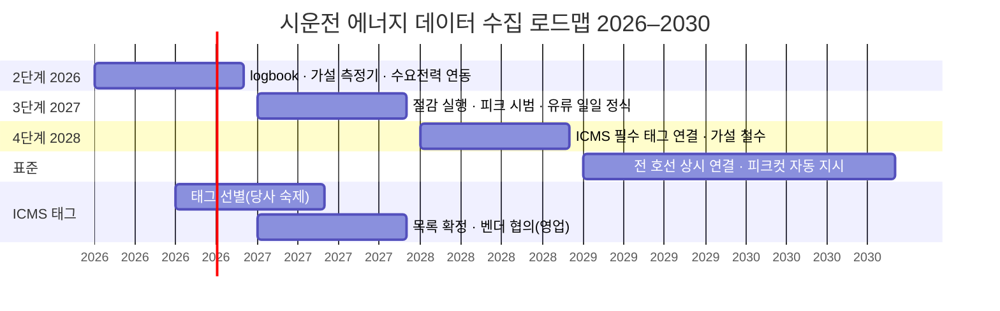

# 시운전 에너지 데이터 수집 로드맵 2026–2030

> **이 문서가 답하는 질문**: 안벽 계류 중인 호선을 **매 시각 육전으로 둘지, 발전기로 돌릴지** —
> 즉 **전기요금과 유류비를 합한 총 에너지 비용이 싼 쪽**을 고르려면 여섯 가지 데이터가 필요하다.
> 그 여섯 가지를 **지금(수기)에서 2030(ICMS 상시 연결)까지 어떤 단계를 거쳐 수집해 갈 것인가**를 적는다.
>
> **절감 레버는 둘이다. 방향이 서로 반대다.**
>
> | | 레버 A — 평시 | 레버 B — 피크 |
> |---|---|---|
> | 상황 | 피크가 아닌 **대부분의 시간** | 조선소 피크 시간대 |
> | 싼 쪽 | **육전** — 발전기를 돌리면 그 시간만큼 **손해** | **발전기** — 조선소 피크를 낮춘다 |
> | 절감 항목 | 불필요 발전기 가동 축소 → **유류비** | 피크 인하 → **기본요금**(12개월 적용) |
> | 전제 | logbook + 가설 측정기 — **2026 데이터만으로 가능** | + 조선소 수요전력 연동 — 2027 시범 |
>
> 레버 A 는 **주장이 아니라 확인**이다. 불가피한 가동(발전기 검사·부하시험)은 호선 이벤트로 식별되므로
> 그것을 걷어내고 **남은 시간을 드러내는 것**이 2026 의 첫 산출물이고, 줄일 여지는 그 다음에 판단한다.
>
> **6종 데이터** — "얼마나 / 어디에 / 왜" 세 덩어리다.
>
> | | # | 항목 | 답하는 것 |
> |---|---|---|---|
> | **얼마나 썼나** | ① | 유류 사용량 | 연료 L |
> | | ② | **전기 사용량** | 선내 총 부하 kW·kWh |
> | | ③ | **급전 원천** | 그 전기가 **육전인가 발전기인가** |
> | **어디에 썼나** (소비처 분석) | ④ | 가동 장비 | **무엇을** 돌렸나 |
> | | ⑤ | **운전방법** | 그 기기를 **어떻게** 운전했나 |
> | **왜 썼나** | ⑥ | 발전기 가동 사유 | 발전기를 **왜** 돌렸나 |
>
> ⚠ **②와 ③은 별개의 계측이 아니다.** ICMS/PMS 가 보는 것은 **선내 총 부하 하나**이고,
> 육상에서 받았든 발전기가 만들었든 **같은 데이터**다. 구분은 **발전기 연결(ACB) 상태**로 된다.
> 그래서 발전기 쪽에 계측기를 따로 달지 않는다.
>
> **단계**
>
> | | 1단계 · 현재 | 2단계 · 2026 | 3단계 · 2027 | 4단계 · 2028 | 표준 · 2029–30 |
> |---|---|---|---|---|---|
> | **한 줄** | 수기 취합 | **logbook + 가설 측정기 + 수요전력 연동** | **절감 실행 + 피크 시범** · ICMS 태그 확정·협의 | **ICMS 필수 태그 연결** | 전 호선 상시 연결 |
> | **유류** | 기간 취합 + 일 1회 사운딩 파일럿 | 사운딩 수기 유지 | 일일 입력 정식 · 엑셀 폐지 | ICMS 유량·탱크 레벨 | **사운딩은 필수 항목만** |
> | **전기** | 육전 누적값 일 단위 수기 | **가설 측정기**(육전 구간 15분) · 발전기는 logbook 추정 | 가동 시간 분류 → 절감 실행 | **ICMS 총 부하 + ACB** → ②③ 동시 실측, 가설 철수 | 실시간 |
>
> **ICMS 는 전 호선 기본 사양이다 — SVESSEL 로 경로를 가르지 않는다.**
> SVESSEL 미설치 호선이 있고(대부분 **Kongsberg ICMS**), 설치됐어도 **늦게 살리면 시운전 초기가 누락**된다.
> 기종·설치 여부와 무관하게 **ICMS 에서 필수 태그를 지정해 연결하는 단일 경로**로 간다.
>
> **조선소 수요전력(한전 15분)은 이미 시스템이 있다.** 2단계에서 연동만 하면 레버 B 의 기준값이 생긴다.
> **레버 A 는 이 연동 없이도 돌아간다** — 발전기 운전일지와 사유 코드만으로 평시 가동 시간이 드러난다.
>
> **범위 밖**: 인도 선박에 탑재하는 선주용 모니터링 제품, 운항 단계 규제(CII·EU ETS 등).
> **표기**: `[사실]` 코드·문서·진술로 확인 · `[추정]` 판단 · `[미확인]` 확인 필요. §6 매트릭스가 도식 변환의 원본이다.

---

## 1. 개요

- **목표는 총 에너지 비용(전기요금 + 유류비)의 최소화**다. 호선의 에너지원은 어느 시각이든
  **육전 아니면 발전기, 하나**이므로 어느 쪽을 쓰느냐가 곧 비용을 정한다.
- **평시에는 육전이 싸다** — 이때 발전기를 돌리면 그 시간만큼 유류비 손해다(레버 A). `[추정]`
  **피크 시간대에만 역전**된다 — 기본요금이 최대수요전력으로 정해지므로, 그 시각에 절체하면
  조선소 피크가 내려가 12개월 요금이 줄어든다(레버 B).
- 즉 발전기는 "돌리면 좋은 것"도 "안 돌리면 좋은 것"도 아니고, **시각에 따라 답이 바뀐다.**
  그 답을 알려면 6종이 **같은 시각 축**에 있어야 하는데, 현재는 유류만 하루 1회 수기이고
  전기는 발전기 쪽 기록이 아예 없다. `[사실]`
- **2단계(2026)에서 logbook 과 가설 측정기, 기존 수요전력 시스템 연동을 마치면 두 레버의 판단 데이터가 갖춰진다.**
  그중 **레버 A 는 수요전력 연동을 기다리지 않고** 운전일지만으로 실태 파악이 시작된다.
- **4단계(2028)의 ICMS 연결이 이 로드맵의 종착점**이다. 가설 장비는 호선마다 달았다 떼야 해서
  설치·철거·인도 전 회수 공수가 계속 든다. ICMS 는 이미 배에 있으므로, 필수 태그를 지정해 받으면
  **가설을 없애면서 ②③을 동시에 실측**하게 된다.

---

## 2. 배경 및 문제 정의

### 2.1 에너지 구조 — 언제 발전기가 이득이고 언제 손해인가

| | 육전(한전 전력) | 발전기(자체 발전) |
|---|---|---|
| 에너지 | kWh | 유류 L → kWh |
| 비용 구조 | **기본요금**(피크 kW × 단가 × 산정 개월) + **전력량요금**(kWh × 시간대 단가) | 유류 L × 유가 (+ 정비비) |
| **kWh 당 원가 (평시)** | **싸다** — 전력량요금 단가 `[미확인]` 계약 종별 | **비싸다** — 약 0.2–0.25 L/kWh × 유가 `[추정]` |
| **kWh 당 원가 (피크)** | 전력량요금 + **기본요금 유발분** → 비싸진다 | 평시와 같다(연료비만) |
| 탄소 | 한전 배출계수(Scope 2) | 유종 배출계수(Scope 1), kWh 당 더 높다 `[추정]` |

- 호선 배전반은 절체 순간을 빼면 **육전·발전기 동시 급전을 허용하지 않는다** → 호선 단위 택1.
- **답은 시각에 따라 뒤집힌다.**

  | | 평시 (레버 A) | 피크 시간대 (레버 B) |
  |---|---|---|
  | 조건 | 그 시각 부하가 조선소 피크를 만들지 않는다 | 그 시각 부하가 **피크를 끌어올린다** |
  | 싼 쪽 | **육전** | **발전기** |
  | 판정식 | `발전기 kWh 원가 > 전력량요금 단가` → 발전기는 **손해** | `기본요금 단가 × 산정 개월 수 > 그 시간대 발전기 연료비 증가분` → 발전기가 **이득** |
  | 절감 방법 | 불필요 가동을 **줄인다** | 의도적으로 **돌린다** |

  `[추정]` 기본요금 산정 규칙(15분 평균·산정 기간·계절 가중) 세부는 `[미확인]`

- **평시 발전기 가동이 전부 낭비는 아니다.** 발전기 검사·부하시험처럼 **어차피 돌려야 하는 시간**은
  호선 이벤트로 식별된다(⑥ 사유 `TRIAL`·`LOAD_TEST`). 육전 불가(`SHORE_NA`)도 정당한 사유다.
  **그것들을 걷어내고 남는 시간이 얼마인지가 레버 A 의 출발점**이고, 지금은 그 비율을 모른다. `[미확인]`
- 부수 관찰 `[추정]`: 발전기 부하·병렬 시험은 어차피 돌리는 시간이므로 그 시각을 **피크에 맞추면**
  추가 연료 없이 레버 B 효과를 얻는다 — 두 레버가 충돌하지 않고 맞물리는 유일한 지점이다.
- 탄소는 두 레버의 방향이 **반대**다 — A 는 배출을 줄이고, B 는 늘린다. 비용·탄소 두 축으로 함께 본다.

### 2.2 전기 데이터의 구조 — 총 부하 하나 + 원천 플래그

> 이 절이 v0.6 의 핵심 정정이다. ②와 ③을 따로 재는 두 계측으로 설계하면 안 된다.

- ICMS/PMS 가 보는 값은 **선내 총 부하(kW)** 하나다. 육상에서 받았든 발전기가 만들었든 **같은 데이터**다. `[사실]` 진술
- 그 부하가 **어느 쪽 비용인지는 발전기 연결(ACB) 상태**로 갈린다.

  | 발전기 ACB | 그 시각 부하의 정체 | 비용 |
  |---|---|---|
  | 연결 안 됨 | **육상 전기** | 전력량요금 (+ 피크 유발분) |
  | 연결됨 | **발전기 전기** | 유류비 |

- 따라서 **발전기 쪽에 계측기를 따로 달지 않는다.** 총 부하 + ACB 상태면 ②③이 동시에 나온다.
- **가설 측정기(shore connection)의 한계**: 육상 쪽에만 붙으므로 **②의 육전 구간만** 잰다.
  발전기가 연결되면 0 을 읽을 뿐, 발전기가 얼마를 만들었는지는 모른다.
  다만 **0 을 읽는 것 자체가 발전기 운전의 단서**가 되므로 ③의 대용으로는 쓸 수 있다.
  발전기가 만든 양은 2026 에 logbook 운전일지(대수·부하%·시간)로 **추정**하고, ICMS 연결 시 실측으로 바꾼다.

### 2.3 결과물 → 필요한 데이터 (우선순위 근거)

| 결과물 | ① 유류 | ② 전기량 | ③ 급전 원천 | ④ 장비 | ⑤ 운전방법 | ⑥ 사유 | 참조: 수요전력·요금표 |
|---|:-:|:-:|:-:|:-:|:-:|:-:|:-:|
| **R1 절체 판단 (양방향)** — 평시엔 육전으로, 피크엔 발전기로 | △ 손익만 | **●** 15분 | **●** 현재 원천 | – | – | ○ | **●** B 판정에 필수 |
| **R2a 평시 불필요 가동 축소 (레버 A)** | **●** 그 시간 연료비 | ○ | **●** | – | ○ | **●** 불가피/확인대상 분리 | – **불필요** |
| **R2b 피크 절감 (레버 B)** | **●** 추가 소비분 | **●** | **●** | – | – | **●** 피크컷 분 분리 | **●** 피크 이력·단가 |
| **R3 호선별 에너지 비용** (연료비 vs 전기비) | **●** | **●** 일 단위면 됨 | **●** | – | – | – | ○ 요금표 |
| **R4 탄소 산정** (직접/간접 배출) | **●** 유종별 | **●** | **●** Scope 1/2 구분 | – | – | – | – |
| **R5 소비처 분석 → 원단위·경비 예측** | **●** | **●** | ○ | **●** | **●** | **●** 어느 항목인지 | – |
| **걸린 결과물 수 → 우선순위** | 6 · **최우선** | 5 · **최우선** | **6 · 최우선** | 1 · 낮음 | 2 · 낮음 | 5 · **높음** | R1·R2b 전제 · 높음 |

- **③ 급전 원천이 모든 결과물에 걸린다.** ②를 아무리 정확히 재도 원천을 모르면 비용도 탄소도 계산되지 않는다.
  그런데 지금 **③은 기록이 전혀 없다.** `[사실]`
- **⑥ 가동 사유**는 불가피한 가동(`TRIAL`·`LOAD_TEST`·`SHORE_NA`)과 **확인 대상(`ETC`)**을
  가르는 유일한 수단이라 **레버 A 전체가 여기에 달려 있다.**
- **레버 A(R2a)는 참조 데이터가 필요 없다** — 수요전력 연동을 기다리지 않고 운전일지만으로 시작된다.
- ④⑤ 소비처 분석은 R5 전용이라 후순위다. 다만 ⑤는 **1차 logbook / 2차 ICMS 분석**으로 성격이 다르다(§4 참조).

### 2.4 데이터별 수집 방법 후보와 현재 수준

| 데이터 | 가능한 수집 방법 (쉬운 것 → 자동) | 현재 수준 | 2단계(2026) 후 |
|---|---|---|---|
| **② 전기량** | ⓐ 접속점 적산계 일 1회 수기 → ⓑ **가설 측정기** 15분 자동(**육전 구간만**) → ⓒ **ICMS 총 부하 태그** | ⓐ 일 누적 수기, 앱 밖 `[사실]` 진술 | **ⓑ 자동**(육전 구간) |
| **③ 급전 원천** | ⓐ logbook 절체 기록 수기 → ⓑ **가설 측정기 전류 0 으로 추정** → ⓒ **ICMS 발전기 ACB 상태** | 없음 `[사실]` | **ⓐ + ⓑ 반자동** |
| **① 유류** | ⓐ 기간 단위 취합(엑셀) → ⓑ 일 1회 사운딩 앱 입력 → ⓒ 발전기 운전시간×SFOC 교차검증 → ⓓ **ICMS 유량·탱크 레벨** | ⓐ 정식 · ⓑ 파일럿(`test_`) `[사실]` | ⓑ 유지 + ⓒ 가능 |
| **⑥ 가동 사유** | ⓐ logbook 매 기동 사유 코드(불가피/확인대상 분리) → ⓑ 시운전 항목은 순서도에서 자동 | 4종, 연료 감소 시만 `[사실]` | **ⓐ 수기** — 레버 A 의 열쇠 |
| **④ 가동 장비** | ⓐ 일별 체크리스트 → ⓑ **ICMS 장비 운전 상태** | 연료 감소 시만 `[사실]` | ⓐ 수기(항목 최소화) |
| **⑤ 운전방법** | ⓐ **logbook (1차)** → ⓑ **ICMS 데이터 분석 (2차 — 검토 과제)** | 없음 | ⓐ 1차 착수 |
| **참조: 조선소 수요전력** | 기존 조선소 전력관리 시스템(한전 15분) → **연동**. 레버 B 에만 필요 | **시스템 있음** `[사실]` 진술 · 미연동 | **연동** |
| **참조: 요금표·유가** | 요금표 등록(수기 1회) · 유가 `fuel_price.parquet` | 유가만 있음 `[사실]` | 요금표 등록 |

> 2단계가 끝나면 **두 레버의 판단 데이터가 전부 생긴다.**
> - **레버 A(R2a)** 는 ③⑥ 만으로 1차 산출이 되므로 **측정기·수요전력 연동을 기다리지 않는다**.
> - **레버 B(R1·R2b)** 는 측정기 + 수요전력 연동이 모두 필요하고, 그 둘이 끝나는 2026 말에 시범이 가능하다.
> - 다만 **발전기가 만든 전기량은 2026 에 추정치**다. 실측은 4단계 ICMS 연결부터다.

### 2.5 현재 수집 상태 (코드 근거)

| # | 데이터 | 지금 어떻게 | 해상도 | 결손 |
|---|---|---|---|---|
| ① | 유류 사용량 | 정식: 월 엑셀 → `fuel_usage.parquet`, 호선당 `일정구분`(`LC~GT+1`/`AC`/`통합시운전`/`ST,DP`/`인도준비`) 기간 단위 `[사실]` `DATA_SCHEMA.md`. 파일럿: SSIMS 일일 사운딩(mm→L, VCF·트림 보정) `[사실]` `log/backend/main.py` | 기간 / 일 | 일일값이 정식 집계로 안 이어짐(이중 입력) |
| ② | 전기 사용량 | 누적 전기사용량 일 단위 수기 `[사실]` 진술. 코드베이스에는 없음 `[사실]` | 일 | 앱 미수용 · 총 부하가 아니라 육전 접속점 값 |
| ③ | 급전 원천 | — | — | **기록 없음.** 육전/발전기 구분이 불가능해 ②의 비용·탄소가 계산되지 않는다 |
| ④ | 가동 장비 | SSIMS ΔL 감소 시에만 장비+대수 → 정격 가중치×대수로 배분 `[사실]` `fuel_reading_equipment` | 감소 이벤트당 | 원천 태그 없음 |
| ⑤ | 운전방법 | — | — | 소비처를 어떻게 운전했는지 기록 없음 |
| ⑥ | 발전기 가동 사유 | SSIMS 사유 4종(검사/지원/앵카링/시운전), 감소 시에만 `[사실]` `usage_reasons` | 감소 이벤트당 | 매 기동 단위 아님. 피크컷 코드 없음 |

---

## 3. 목표

| 단계 | 시기 | 도달 상태 | 완료 기준 |
|---|---|---|---|
| 1단계 | 현재 | 유류 수기, 전기 기록 없음 | 현황 확정 · 기준선 착수 |
| **2단계** | **2026** | logbook(③④⑤⑥ 수기) + 가설 측정기(② 육전 구간 자동) + 수요전력 연동 + 요금표 | **M1 6종 전부 존재** + **발전기 가동 시간의 불가피/확인대상 비율 산출** |
| 3단계 | 2027 | **평시 절감 실행(레버 A) + 피크 절체 시범(레버 B)** · 유류 일일 정식(엑셀 폐지) · **ICMS 필수 태그 목록 확정 + 벤더 협의** | **M2 총비용 절감액 실측** · 태그 표준 사양 확정 |
| 4단계 | 2028 | **ICMS 필수 태그 연결** — 총 부하·ACB·유량·장비 상태. ②③ 실측 전환, **가설 측정기 단계적 철수** | **M3 ICMS 연결 호선 확보** · 가설 철수 착수 |
| 표준 | 2029–30 | 전 호선 상시 연결 · 관제 피크컷 지시 · **사운딩은 필수 항목만** | **M4 절체 판단 무개입** |

- 최종 KPI: **매 시각 총 에너지 비용이 싼 쪽을 수기 개입 없이 고른다** — 6종이 같은 시각 축(15분)에 모인 상태. (2030)
- 중간 KPI(2026): **시운전 시험 외 발전기 가동 시간의 비율** — 현재 `[미확인]`, M1 의 핵심 산출물이다.
- 수기로 남는 항목: 4종(2026) → 3종(2027) → **⑥ 사유 + ⑤ 1차**(2028~) `[추정]`
  ⑥은 사람만 아는 정보라 **끝까지 수기로 남는다.**

---

## 4. 핵심 개념 정의

| 용어 | 정의 |
|---|---|
| **logbook** | 현장 앱(SSIMS)의 발전기 운전일지 — 기동/정지 시각·부하%·대수·가동 사유·절체 기록. 수기 4종(③④⑤⑥)의 단일 입력 창구 |
| **가설 계측기** | 호선에 임시로 달았다 떼는 조선소 자산 계측기. 현 계획의 **shore connection 전력계**가 이것이다. 설치·철거·인도 전 회수 공수가 계속 들고 자산 관리 부담이 있다 — **ICMS 연결로 대체하는 것이 4단계의 목적**이다 |
| **② 전기 사용량** | **선내 총 부하(kW·kWh)**. 육전이든 발전기든 같은 값이다 |
| **③ 급전 원천** | 그 시각 부하의 공급원. `SHORE`(육전) / `GEN`(발전기) 두 값. **발전기 ACB 연결 상태로 판별**되며 ICMS 연결 시 자동으로 채워진다. ②의 비용·탄소를 가르는 키이고 ④⑤⑥ 이 모두 여기에 붙는다 |
| **⑤ 운전방법** | **소비처 분석** — 발전기가 아니라 전기·유류를 쓰는 **다른 기기를 어떻게 운전했나**. **1차는 logbook**(사람이 적는다), **2차는 ICMS 데이터 분석**이며 **2차는 검토 과제**다. ⚠ 1차 입력 항목도 2차 분석 방법도 아직 정해지지 않았다 — **코드 목록을 임의로 만들지 않는다** `[미확인]` |
| **⑥ 가동 사유** | 발전기를 **왜** 돌렸는지. 현 4종을 흡수하고 **불가피/확인대상**을 가른다 — 레버 A 의 열쇠 · **불가피** `TRIAL`(시운전 항목 ID 동반) · `LOAD_TEST`(부하·병렬 시험) — 호선 이벤트로 자동 식별 가능 · **정당** `SHORE_NA`(육전 불가 — 설비·공사) · **의도적** `PEAK_CUT`(레버 B 로 일부러 돌림) · **확인 대상** `ETC` — 위 어디에도 안 들어가는 시간. **이 몫을 드러내는 것이 2026 의 산출물** |
| **ICMS · PMS** | 선내 통합제어감시 · 전력관리. **전 호선 기본 사양**이다. PMS 가 총 부하·발전기별 kW·차단기 상태를, ICMS 가 유량·탱크 레벨·장비 운전 상태를 이미 갖고 있다. 4단계의 일은 계측이 아니라 **송출**이다 |
| **ICMS 필수 태그 연결** | 6종을 만들기 위해 ICMS/PMS 에서 **뽑을 태그를 지정해 조선소로 연결**하는 것. **기종·SVESSEL 유무와 무관한 단일 경로.** SVESSEL 을 기준으로 삼지 않는 이유 셋 — ① 미설치 호선이 있고 대부분 **Kongsberg ICMS** 다 ② 설치됐어도 **늦게 살리면 시운전 초기가 누락**된다 ③ 유무로 경로가 갈리면 수집 코드가 두 벌이 되어 곧 드리프트가 쌓인다 |
| **송출 태그 선별** | 위 "필수 태그"가 무엇인지 정하는 목록 + 표준 태그 → 호선 태그 매핑표. **당사 숙제**, 3단계(2027)에 확정 |
| **SVESSEL** | 스마트십 플랫폼. 탑재 호선은 ICMS/PMS 값이 이미 육상에 올라오므로 **있으면 보조 수단으로 쓴다**. **경로를 가르지 않는다** |
| **호선 대장** | 호선별 SVESSEL 유무 · ICMS 기종(Kongsberg 등) · 태그 매핑 · ICMS 가동 시점 기록. **수집 경로가 아니라 협의 대상과 태그 매핑을 가른다** |
| **레버 A / 레버 B** | A = 평시 불필요 발전기 가동 축소(유류비 절감, 참조 데이터 불필요) · B = 피크 시간대 절체(기본요금 절감, 수요전력 연동 필요). 탄소 방향은 서로 반대 |
| **피크 컷 지시** | 관제(SSIMS 웹)가 수요전력 추이를 보고 특정 호선에 발전기 절체를 요청하는 이벤트. 3단계 수동 → 표준 단계 자동 |

---

## 5. 단계별 수집 방법

### 5.0 측정 지점·방법 요약

읽는 법: 1~3단계는 **사람이 재거나 조선소가 임시로 붙인 계측기**, 4단계부터는 **배가 원래 갖고 있는 ICMS/PMS** 에서 받는다.

| 데이터 | 1단계 현재 | 2단계 2026 | 3단계 2027 | 4단계 2028~ (ICMS 필수 태그 연결) |
|---|---|---|---|---|
| **① 유류** | **지점** 연료 탱크 **방법** 사운딩 → 기간 취합 엑셀 / 일 1회 앱 파일럿 | 수기 유지 · ③×SFOC 교차검증 | 일일 입력 정식 · 엑셀 폐지 | **지점** 연료 공급/리턴 유량계 + 탱크 레벨 **방법** ICMS 태그 · **사운딩은 필수 항목만**(수급·이송·검증) |
| **② 전기량** | **지점** 접속점 적산계 **방법** 누적 kWh 일 1회 수기 | **지점** shore connection box(**가설**) **방법** 15분 자동 — **육전 구간만** | 수요전력과 시각 정렬 | **지점** 선내 주배전반 **총 부하** **방법** ICMS/PMS 태그 → **가설 철수** |
| **③ 급전 원천** | 없음 | **방법** logbook 절체 기록 + 가설 전류 0 으로 추정 | 절감 실행에 활용 | **지점** **발전기 ACB 상태** **방법** PMS 태그 — 자동 |
| **④ 가동 장비** | 감소 시만 | **방법** logbook 일별 체크리스트 (항목 6~8종) | 사유별 집계 | **지점** ICMS 장비 운전 상태 |
| **⑤ 운전방법** | 없음 | **방법** logbook **1차** (항목 미정 `[미확인]`) | 1차 데이터 축적 | **2차 ICMS 분석 — 검토 과제** |
| **⑥ 가동 사유** | 4종·감소 시만 | **방법** logbook 매 기동 사유 코드 | 확인대상 가동 축소 | `TRIAL`·`LOAD_TEST` 순서도 자동 · **나머지는 계속 수기** |
| **참조** | 수요전력 시스템 있음·미연동 | **연동** + 요금표 등록 | 피크 시범에 사용 | 관제 자동 지시 |

- 4단계 선행 작업: **송출 태그 선별**(당사 숙제) — 위 표의 4단계 "지점" 열이 곧 태그 목록의 골격이다.
- **⑥은 4단계 이후에도 수기가 남는다** — 왜 돌렸는지는 사람만 안다. logbook 은 없어지지 않는다.

### 5.1 유류 트랙 (①)

| 단계 | 시기 | 수집 방법 | 해상도 | 앱 변경 |
|---|---|---|---|---|
| 1단계 | 현재 | 호선당 5~6개 `일정구분` 기간별 취합 → 월 엑셀 → `fuel_usage.parquet` `[사실]` + SSIMS 일 1회 사운딩 파일럿 | 기간 / 일 | — |
| 2단계 | 2026 | 수기 유지. logbook 의 발전기 운전시간×정격×SFOC 로 **기대 소비량**을 산출해 사운딩 ΔL 과 교차검증 | 일 | 편차 표시 |
| 3단계 | 2027 | SSIMS 일일 입력 **정식**(`test_` 해제), 측정 시각·트림 필수. 일일값을 `trial_schedule` 일정구분 경계로 잘라 `fuel_usage` 형식으로 산출 → **월 엑셀 폐지** | 일 | 기간 산출 잡(`data_manager_F`) |
| 4단계 | 2028 | **ICMS 유량·탱크 레벨 태그 연결** — 분 단위 실측. 사운딩과 병행해 오차 검증 | 분 | ICMS 수신기 · 편차 표시 |
| 표준 | 2029–30 | 전 호선 ICMS. **사운딩은 필수 항목만 남긴다** — 수급(벙커링) 검수 · 탱크 간 이송 확인 · 유량계 오차 검증 · 유량계가 없는 탱크/유종. 대체연료 포함 | 분 | 일일 사운딩 입력만 해제, **필수 항목 입력은 유지** |

- 리스크: 호선별 ICMS 기종·태그 명명이 다름 → **호선 대장**에 기종을 기록하고 표준 태그 → 호선 태그 매핑표를 관리 ·
  태그 연결 프로그래밍은 **당사 표준 사양**, 벤더 협의는 **영업 경유**

### 5.2 전기 트랙 (② 전기 사용량 · ③ 급전 원천)

> 두 항목은 **하나의 부하 데이터 + 원천 플래그**다(§2.2). 따로 재지 않는다.

| 단계 | 시기 | 수집 방법 | 해상도 | 앱 변경 |
|---|---|---|---|---|
| 1단계 | 현재 | ② 접속점 적산계 누적값 일 단위 수기(앱 밖). ③ 없음 | 일 | — |
| **2단계** | **2026** | ② **가설 shore connection 측정기** 15분 자동 → parquet. **육전 구간만 실측**되고 발전기 구간은 0 이다. ③ 은 **logbook 절체 기록 + 측정기 전류 0** 으로 반자동 판별. 발전기가 만든 양은 **운전일지로 추정**(대수·부하%·시간). **조선소 수요전력 시스템 연동** + 요금표 등록 → 레버 B 준비 완료 | 15분 / 기동 | 측정기 수신 경로 · logbook 메뉴 · 가동 시간 분류 리포트 · 수요전력 연동 |
| 3단계 | 2027 | **평시 절감 실행(레버 A)** — 확인 대상 가동 시간을 호선·사유별로 줄이고 감소분을 유류비로 환산(R2a). **피크 절체 시범(레버 B)** — 관제가 수요전력 추이를 보고 절체 요청, logbook 에 `PEAK_CUT` 기록 → 기본요금 인하분 − 추가 연료비 산정(R2b). 둘을 합쳐 **총비용 절감액 실측**. 병행해 **ICMS 필수 태그 목록 확정·벤더 협의** | 15분 / 1분 | 관제 화면 피크 여유 · 가동 시간 추이 |
| **4단계** | **2028** | **ICMS 연결** — 선내 **총 부하** + **발전기 ACB 상태** 태그 수신. ②③ 이 **동시에 실측**으로 바뀌고 발전기 발전량 추정이 사라진다. 연결된 호선부터 **가설 측정기 철거** | 1분 | ICMS 수신기 · 태그 매핑 · 가설 자산 회수 |
| 표준 | 2029–30 | 전 호선 상시 연결. 관제가 피크컷을 자동 지시 | 실시간 | — |

- **가설 철수 조건**: 선내 총 부하와 ACB 상태 태그가 ICMS 에 있어야 한다 `[미확인]`.
  없으면 해당 호선은 가설을 유지한다 — 대장에 기록해 관리한다.
- 리스크: 가설 설치·철거·인도 전 회수 공수가 연결 전까지 계속 든다 ·
  **ICMS 는 선내 커미셔닝 후에야 살아난다** — 안벽 초기 구간은 ICMS 가 없을 수 있어 가설·수기가 필요하다 `[미확인]` ·
  ICMS 태그 접근 방식(프로토콜)이 기종별로 상이 `[미확인]` Kongsberg 우선 확인 ·
  수요전력 시스템 제공 방식(API/파일/DB)·담당 부서 `[미확인]`

### 5.3 소비처 분석 (④ 가동 장비 · ⑤ 운전방법) 과 사유 (⑥)

④⑤는 **무엇을 어떻게 돌렸나**(소비처), ⑥은 **발전기를 왜 돌렸나**(원천 측)다. 셋 다 ③ 급전 원천에 붙는다.

| 단계 | ④ 가동 장비 | ⑤ 운전방법 (소비처 분석) | ⑥ 발전기 가동 사유 |
|---|---|---|---|
| 현재 | 감소 시에만 장비+대수 | 없음 | 4종, 감소 시에만 |
| **2단계 2026** | logbook **일별 체크리스트**(항목 6~8종으로 제한) | **1차 = logbook.** 입력 항목은 **아직 미정** `[미확인]` — 현장과 정해 최소로 시작한다 | logbook **사유 코드 5종**, 매 기동 필수 |
| 3단계 2027 | 사유·장비별 집계 | 1차 데이터 축적 · **2차(ICMS 분석) 방법 검토 착수** | 확인대상 가동 축소(레버 A) · `PEAK_CUT` 기록 |
| 4단계 2028 | ICMS 장비 운전 상태에서 자동 | **2차 = ICMS 데이터 분석 — 검토 과제**, 많은 고민이 필요하다 | `TRIAL`·`LOAD_TEST` 는 `process` 순서도에서 자동 |
| 표준 | 자동 · 장비별 원단위 | 분석 결과를 원단위에 반영 | `PEAK_CUT` 관제 자동 · **`SHORE_NA`·`ETC` 는 계속 수기** |

- logbook 은 하루 시작 시 한 화면에서 원천·장비·발전기 상태를 묶어 입력 → 자동화되는 즉시 수기 항목 제거
- **⑤에 코드 체계를 미리 만들지 않는다.** 1차 입력 항목은 현장과 정하고, 2차 분석 방법은 별도 검토 과제다.
- 리스크: 체크리스트 형식화 → 장비 6~8종 제한 · 사유가 `ETC` 로 몰림 → 5종 고정, 상세는 자유입력(실명 금지)

---

## 6. 로드맵 매트릭스 (도식 변환용 원본)

행 = 데이터 항목, 열 = 단계, 셀 = **그 단계에 도달하는 수집 방법**.
배경색은 수기(회색) · 조선소 가설/반자동(연청) · ICMS 연결(청) · 표준(진네이비).

| # | 데이터 | 1단계 · 현재 | **2단계 · 2026** | 3단계 · 2027 | **4단계 · 2028** | 표준 · 2029–30 |
|---|---|---|---|---|---|---|
| ① | 유류 사용량 | 기간 취합 + 일 1회 사운딩 파일럿 | 수기 유지 · ③×SFOC 교차검증 | 일일 정식 · 엑셀 폐지 | **ICMS 유량·탱크 레벨** | 전 호선 자동 · **사운딩은 필수 항목만** · 대체연료 |
| ② | 전기 사용량 | 일 누적 수기(앱 밖) | **가설 측정기 15분** (육전 구간만) | 수요전력과 정렬 | **ICMS 총 부하** · **가설 철수** | 실시간 · 피크 여유 표시 |
| ③ | 급전 원천 | 없음 | logbook 절체 기록 + 전류 0 추정 | 절감 실행에 활용 | **ICMS 발전기 ACB 상태** (자동) | 실시간 · 실측 SFOC |
| ④ | 가동 장비 | 감소 시만 | logbook 일별 체크리스트 | 장비별 집계 | ICMS 장비 운전 상태 | 자동 · 장비별 원단위 |
| ⑤ | 운전방법 | 없음 | **1차 logbook** (항목 미정) | 1차 축적 · 2차 방법 검토 | **2차 ICMS 분석 (검토 과제)** | 원단위에 반영 |
| ⑥ | 발전기 가동 사유 | 4종·감소 시만 | **logbook 사유 코드 5종 · 매 기동** | 확인대상 축소 · `PEAK_CUT` 기록 | `TRIAL`·`LOAD_TEST` 순서도 자동 | **`SHORE_NA`·`ETC` 는 계속 수기** |
| 참조 | 조선소 수요전력·요금표 | 시스템 있음 · 미연동 | **연동 + 요금표 등록** (레버 B 에만 필요) | **피크 절체 시범** · 절감 산정 | 관제 화면 통합 | 피크컷 자동 지시 |
| 태그 | ICMS 필수 태그 | — | 태그 선별 초안(당사 숙제) | **목록 확정 · 표준 사양 · 벤더 협의(영업)** | **연결 적용** | 표준 사양 정착 |
| — | **마일스톤** | 현황 확정 | **M1 6종 확보 + 평시 가동 실태 파악** | **M2 총비용 절감액 실측(A+B)** | **M3 ICMS 연결 · 가설 철수 착수** | **M4 절체 판단 무개입** |

---

## 7. 현재 과제와의 관계

| 과제 | 로드맵에서의 역할 | 채우는 데이터 | 기여 결과물 | 단계 | 필요한 확장 |
|---|---|---|---|---|---|
| **logbook** (SSIMS, `log`) | **수기 4종의 단일 입력 창구.** 뒤에는 ICMS 수신값 표시·관제 지시 창구. **⑥ 때문에 끝까지 없어지지 않는다** | ③④⑤⑥ + ① 일일 | R2a·R3·R4·R5 원천, R1·R2b 의 호선 쪽 절반 | 2단계 핵심 | 운전일지·절체·사유·장비 메뉴, `test_` 해제, 일일값 → 기간 집계 자동 |
| **시운전선박 전기모니터링** (가설 측정기) | 2026 의 **유일한 자동 계측.** ②의 육전 구간을 15분으로 만들고 ③ 판별 단서를 준다. **4단계에 철수하는 것이 전제** | ② 육전 구간 · ③ 단서 | R1·R2b·R3·R4 | 2단계 · 2026 | 측정값 → parquet 경로 · 설치/철거 절차서 · 자산 대장 |
| **조선소 수요전력 시스템** (기존) | 피크 판단의 **기준값**. 로드맵은 연동만 한다 | 참조 | R1·R2b | 2단계 | 15분 값 수신(제공 방식·담당 `[미확인]`) |
| **ESG 대시보드** (`esg`) | 결과물을 **보여주는 출력 화면.** 데이터를 만들지 않는다 | — | 지금 R4 · R3(유류만) → R2a·R2b 절감 효과 | 데이터가 생긴 뒤(3단계) | 전기 축(Scope 1/2 구분은 ③에서 나온다), **총비용 = 유류비 + 전기요금** 합산 뷰 |
| `data_manager_F` | 셋을 잇는 관 — parquet 단일 생산자 | — | (연결) | 2단계 | `fuel_daily` · `power_ts`(부하 + 원천) · `gen_run` · `equip_daily` · `tariff`(가칭) |
| **ICMS 수신기** (신규, `*_collector`) | 4단계의 실행 주체. 사내망 상주, 호선별 태그 매핑을 갖고 ICMS 에서 필수 태그를 받는다 | ①②③④ 자동화 | 전부 | 4단계 | 신규 개발 · parquet 은 `data_manager_F` 경유 원칙 |
| `process` (순서도) | ⑥ 시운전 항목 자동 태깅의 시각 축 | ⑥ 일부 | R5 | 4단계 | 항목 시각 필드 — 지금은 손대지 않는다 |
| `costplan` / `pjtcost` | R5 소비자 | — | R5 | 표준 | 없음(후순위) |

**순서**: 가설 측정기 + logbook(데이터 생산) → 수요전력 연동 + data_manager(저장) → ESG 확장(표시) → ICMS 수신기(자동화).
ESG 를 먼저 고치면 보여줄 데이터가 없다.

**과제로 잡혀 있지 않은 것**: 전기요금표 등록(작음) · **ICMS 필수 태그 선별(당사 숙제, 2026 하반기 착수해야 2028 에 맞는다)** ·
벤더 협의(영업 경유) · **⑤ 운전방법의 1차 입력 항목 설계와 2차 분석 방법 검토**.

---

## 8. 리스크 및 대응

| 리스크 | 영향 | 대응 |
|---|---|---|
| logbook 입력 부담(2단계에 수기 메뉴 신설) | 누락률 악화 | 하루 시작 시 한 화면 묶음 입력 · 장비 항목 6~8종 제한 · 자동화되는 즉시 수기 제거 |
| **가설 측정기 설치·철거·회수 공수** | 2026~2028 내내 부담 | 절차서·자산 대장로 관리하고, **4단계 ICMS 연결로 철수하는 것을 전제**로 설계 |
| **ICMS 커미셔닝 전에는 ICMS 가 안 살아 있다** | 안벽 초기 구간 데이터 공백 | 그 구간은 가설·수기로 덮는다. 호선별 **ICMS 가동 시점**을 대장에 기록 `[미확인]` |
| ICMS 에 총 부하·ACB 태그가 없는 호선 | 가설 철수 불가 | 대장에 표기하고 해당 호선만 가설 유지 |
| 태그 선별이 늦어짐(당사 숙제) | 4단계 전체 지연 | 2026 하반기 초안, 2027 확정. 태그가 정해져야 벤더 협의가 시작된다 |
| ICMS 기종별 프로토콜·태그 명명 상이 | 4단계 연결 | **당사 표준 사양**(태그 명세)으로 통일해 호선마다 재협의하지 않게. 협의는 영업 경유. Kongsberg 우선 확인 |
| **⑤ 2차 분석 방법이 미정** | R5 원단위 지연 | 1차 logbook 데이터를 먼저 쌓고, 분석 방법은 별도 검토 과제로 진행 |
| 사내망 격리·수신 경로 | ICMS 수신기 | store-and-forward + 수동 반출 폴백, `app_config` 망 감지 규약 준수 |
| 피크컷 권고가 시운전 안전·일정과 충돌 | 3단계 시범 | 권고는 **제안**으로만, 최종 판단은 시운전 책임자 |

---

## 9. 투자 및 기대효과 (개요)

- **투자**: 2단계 가설 측정기(조선소 자산) · 4단계 ICMS 수신 인프라. logbook·연동은 자체 개발. 금액은 사양 확정 후 `[미확인]`
- **기대효과 = 총 에너지 비용(전기요금 + 유류비) 절감**이고, 레버 둘의 합으로 보고한다. `[추정]`

  | | 레버 A — 평시 불필요 가동 축소 | 레버 B — 피크 절체 |
  |---|---|---|
  | 절감 | **유류비** (줄인 가동 시간 × 시간당 연료비) | **기본요금** (피크 인하 kW × 단가 × 12개월) |
  | 대가 | 없음 — 육전 전력량요금은 발전기 원가보다 싸다 | **추가 연료비** (절체 시간 × 시간당 연료비) |
  | 탄소 | **감소** | **증가** |
  | 착수 | 2026 실태 파악 → 2027 실행 | 2026 연동 → 2027 시범 |

  총 순효과 = A(유류비 절감) + B(기본요금 절감 − 추가 연료비). 탄소는 A 와 B 가 **반대 방향**이므로 별도로 집계한다.
- **부수 효과**: 4단계 ICMS 연결로 **가설 장비 설치·철거 공수가 사라진다** — 절감액과 별도로 집계한다.
- 절감액은 2단계 기준선 확보 후 3단계에서 **실측**한다 — 이 로드맵의 1차 산출물은 절감액이 아니라 절감액을 계산할 수 있는 데이터다.
- **레버 A 는 추가 투자 없이 2026 데이터만으로 시작된다** — 측정기·수요전력 연동이 늦어져도 실태 파악과 절감은 진행된다.

---

## 부록 — 확인 필요 항목(`[미확인]` 모음)

1. 한전 산업용 기본요금의 피크 산정 규칙(15분 평균·산정 기간·계절) 및 조선소 계약 종별
2. 조선소 수요전력 시스템의 담당 부서 · 데이터 제공 방식(API/파일/DB) · 제공 주기
3. **ICMS 에 선내 총 부하·발전기 ACB 상태 태그가 있는지** — 가설 철수 가능 여부의 전제
4. **ICMS 기종별 태그 접근 방식(프로토콜)** — Kongsberg 우선. 표준 태그 → 호선 태그 매핑 기준
5. **호선별 ICMS 가동 시점** — 안벽 초기 어느 시점부터 ICMS 데이터가 나오는지
6. **⑤ 운전방법의 1차 logbook 입력 항목**과 **2차 ICMS 분석 방법** — 둘 다 미정, 검토 과제
7. 현재 입력 누락률·사운딩 오차율 실측치
